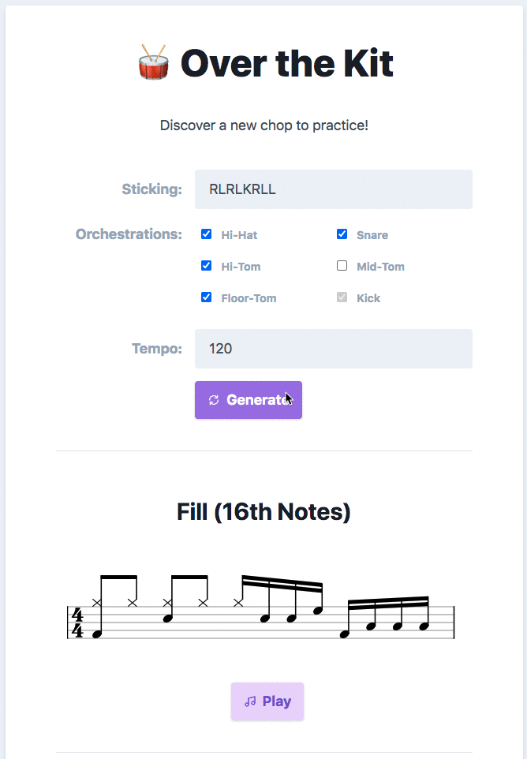

# Over the Kit
A common practice for developing drumkit chops is to take a sticking pattern and orchestrate it "over the kit". For example, the sticking pattern **RLK** (which translates to right hand, left hand, kick drum) can be played over a 16th notes as RLK-RLK-RLK-RLK-RLRL (the last 4 notes being "padding"). This web app allows the drummer to take a sticking pattern and generate and hear different orchestrations, in different contexts.

# Tech
The key technologies and libraries used:
- vanilla javascript
- [vexflow](https://github.com/0xfe/vexflow)
- Web Audio

As I've worked mostly with React, I honestly wasn't sure which parts of the ES6 syntax were safe to use, so ended up trying to avoid most of them (especially `imports`, which leads to the terrible use of the terrible, liberal use of external `<script>`s).

The code is pretty OO-influenced, with a "pipeline" that generates the scores and lines up audio via:
- **StickingPadder**, which "pads" missing notes when trying to fill the sticking for each bar
- **Orchestrator**, which takes a sticking and orchestrates it
- **GrooveGenerator**, which prepends a groove to the orchestrated sticking

It's all pretty messy still, I made some early stabs at separating out domain models (e.g. Score, Notes) but still am not super happy with it...
